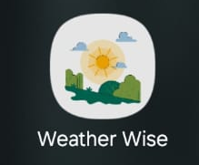

# Welcome to "Weather Wise" 


This document provides an overview of the codebase for a Flutter weather application. It explains the purpose and functionality of each section and file, detailing how the various components interact to form the complete application.

## Screenshots

### Mobile View


## Versions and Tools Used
- **Flutter**: 3.27.2
- **Dart**: 3.6.1

To set up the project, ensure that the versions of Flutter and Dart are as mentioned above. You can manage Flutter versions using FVM (Flutter Version Management).

## Project Structure

```Project Structure
<lib>
└── lib
    ├── core
    │   ├── api
    │   │   ├── location_api.dart
    │   │   └── weather_api.dart
    │   ├── base
    │   │   ├── service_locator.dart
    │   │   └── theme.dart
    │   ├── cubit
    │   │   ├── weather_cubit.dart
    │   │   └── weather_state.dart
    │   ├── database
    │   │   └── database_helper.dart
    │   └── models
    │       ├── forecast_model.dart
    │       └── weather_model.dart
    ├── features
    │   ├── onboarding
    │   │   └── coin_screen.dart
    │   └── weather
    │       ├── weather_detective.dart
    │       └── weather_report.dart
    ├── shared
    │   ├── utils
    │   │   ├── color_extensions.dart
    │   │   ├── message_utils.dart
    │   │   └── permissions_utils.dart
    │   └── widgets
    │       ├── additional_details_widget.dart
    │       ├── k_button.dart
    │       ├── k_drawer.dart
    │       ├── k_header.dart
    │       ├── k_option.dart
    │       ├── k_row_options.dart
    │       ├── sun_path_widget.dart
    │       └── weather_report_card.dart
    └── splash_screen.dart
    ├── loading_screen.dart
    ├── main.dart
</lib>
   ```

## How to Start the Project

1. Clone the repository:
   ```bash
   git clone https://github.com/yourusername/weather-wise.git
   ```
2. Navigate to the project directory:
   ```bash
   cd weather-wise
   ```
3. Get the dependencies:
   ```bash
   flutter pub get
   ```
4. Run the project:
   ```bash
   flutter run
   ```

## Generated APK

The generated APK can be found in this link:
```bash
https://1drv.ms/u/c/bdc16899e0777466/EbKgqF3IPp1Dg8jsgScXTNoBIeK1pnz3ENNm6fQgvUryUg?e=jCtt2F
```

## Key Dependencies

### State Management and Architecture
- **flutter_bloc: ^9.0.0** - Implements the BLoC (Business Logic Component) pattern for state management, making it easier to separate business logic from UI.
- **get_it: ^8.0.3** - A simple service locator for dependency injection, helping to manage singleton instances across the app.
- **equatable: ^2.0.7** - Simplifies equality comparisons for objects, particularly useful with BLoC pattern for state comparison.

### Media and UI
- **video_player: ^2.9.2** - Enables video playback functionality, used for weather animations and background effects. Used for videos playing on the splash screen
- **share_plus: ^10.1.4** - Provides sharing capabilities to allow users to share weather information with others. Used for "Share Weather" button

### Data Formatting and Localization
- **intl: ^0.20.2** - Handles internationalization and date/time formatting for weather data display. Used for Date handling

### Location Services
- **geolocator: ^13.0.2** - Provides geolocation functionality to get user's current location for weather data. Used for the "Current Location" on weather report

### Local Storage
- **sqflite: ^2.4.1** - SQLite plugin for Flutter, used for local storage of weather data and user preferences. Used to save "saved locations" on the drawer
- **path_provider: ^2.1.5** - Helps locate appropriate storage locations on the device for saving app data. Used for "Share Weather" button to save the file locally to send it via whatsapp

